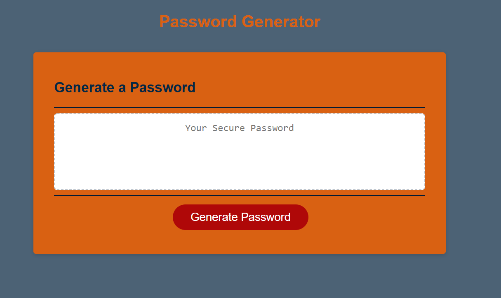

# RandomPasswordGenerator

# Installation
Find at this address: https://chermill93.github.io/RandomPasswordGenerator/

# Instructions
Once page is opened, click 'Generate Password' button, enter length of characters it needs to be and follow the on-screen prompts to add number, special characters, and upper and lower case letters. This will generate your password in the box.

# Credits
Classmate Omar Valdivia-Samudio

# Usage
Follow on screen prompts to generate a unique password.

# License
N/A
Github License

# GitHub
CherMill93
Developer's Profile : https://github.com/CherMill93

